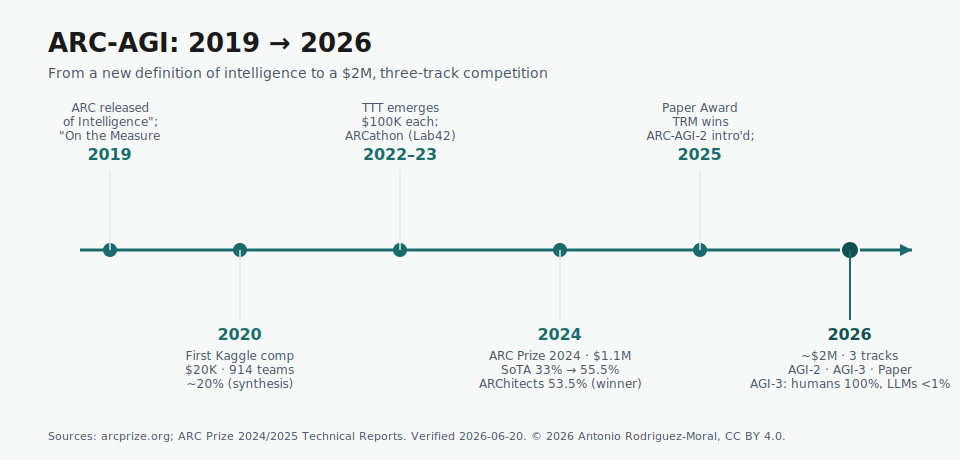

# arc-agi

*What ARC-AGI is, where it came from, and what the ARC Prize 2026 actually asks for — a sourced explainer.*

## Why this repo

ARC-AGI is, to my eye, the most intellectually honest benchmark in AI right now: it
measures whether a system can solve novel problems it was never trained on, rather
than how much of the internet it has memorised. This repo is an accessible, sourced
explainer of **what ARC-AGI is, where it came from, how solvers have evolved, and
what the ARC Prize 2026 competition asks for** — a clean front door to the topic for
anyone trying to make sense of it.

> **Dating discipline.** Competition dates, prize amounts and leaderboard numbers
> move. Every time-sensitive claim below is dated and linked in [Sources](#sources),
> and was re-verified on **2026-06-20**. Re-check `arcprize.org` and Kaggle before
> relying on any figure.

## Contents

1. [What ARC-AGI is](#1-what-arc-agi-is)
2. [A short history (2019 → today)](#2-a-short-history-2019--today)
3. [How solvers have evolved](#3-how-solvers-have-evolved)
4. [ARC Prize 2026 — the three tracks](#4-arc-prize-2026--the-three-tracks)
5. [Why ARC-AGI-3 is a real departure](#5-why-arc-agi-3-is-a-real-departure)
6. [Sources](#sources)

Deeper dives live in [`docs/`](docs/): a fuller [history](docs/history.md), an
annotated tour of [solver approaches](docs/approaches.md), and a side-by-side of
the [two 2026 tracks](docs/arc-agi-2-vs-3.md).

---

## 1. What ARC-AGI is

**ARC** — the *Abstraction and Reasoning Corpus* — is a benchmark of small visual
grid puzzles. Each task gives you a handful of input→output examples; you infer the
transformation rule and apply it to a new input. The grids are deliberately simple
(coloured cells on a grid a child can read), but every task embodies a *different*
rule, and the test tasks are novel — there is no shared "skill" you can drill and
reuse across them.

That design is the whole point. ARC-AGI was introduced by **François Chollet** in
*"On the Measure of Intelligence"* (2019), which argued that we had been measuring
the wrong thing. Most benchmarks reward **skill** — performance at a specific task —
but skill can be bought with data and compute, so a high score tells you little
about intelligence. Chollet's alternative is to measure **skill-acquisition
efficiency**: how well a system turns a small amount of experience with a *novel*
problem into competence at it. That is closer to what psychologists call **fluid
intelligence**, and it is what ARC-AGI is built to probe.

Two consequences follow, and they explain why ARC has stayed hard:

- **Memorisation doesn't transfer.** Because each task has its own rule and the
  evaluation tasks are held out, a system that has merely seen a lot of data has no
  edge. You have to *generalise* to a problem you have never encountered.
- **Humans find it easy; machines don't.** ARC tasks are calibrated to be solvable
  by people. The gap between human and machine performance is therefore a fairly
  clean read on the kind of generalisation machines still lack.

The **ARC Prize Foundation** — a non-profit co-founded in 2024 by **Mike Knoop**
and **François Chollet** — stewards the benchmark and runs the annual competition.
Its framing is consistent: an unsolved ARC-AGI is evidence that something important
about general intelligence is still missing, and closing it efficiently (small,
self-contained systems rather than ever-larger models) is the interesting prize.

> For the conceptual roots, Chollet's *On the Measure of Intelligence*
> ([arXiv:1911.01547](https://arxiv.org/abs/1911.01547)) is the primary source.

## 2. A short history (2019 → today)

A compressed version of the story (full detail, with sources, in
[`docs/history.md`](docs/history.md)):

- **2019 — The idea.** Chollet publishes *On the Measure of Intelligence* and
  releases ARC: a definition of intelligence as skill-acquisition efficiency, and a
  benchmark built to resist memorisation.
- **2020 — First Kaggle competition.** A **$20K** contest drew **914 teams**. The
  winner reached roughly **20%** using brute-force **program synthesis** over a
  hand-built domain-specific language (DSL) — a style that would dominate for years.
- **2022–2023 — ARCathon (Lab42).** Two **$100K** editions hosted by **Lab42**
  kept the benchmark alive and broadened international participation between the big
  Kaggle years.
- **2024 — Deep learning arrives.** **ARC Prize 2024** (a **$1.1M** pool, ~1,430
  teams) saw the private-eval state of the art jump from **33% → 55.5%**, driven by
  **test-time training** and **LLM-guided program synthesis**. The eligible winner,
  *"the ARChitects,"* scored **53.5%**; *MindsAI* posted the top **55.5%** but did
  not open-source and was therefore ineligible. The 85% Grand Prize went unclaimed.
- **2025 — A harder benchmark.** **ARC-AGI-2** was introduced, redesigned to resist
  2024-era recipes. A tiny-model paper, **TRM** (Tiny Recursive Models), won the
  **ARC Prize 2025 Paper Award**.
- **2026 — Three tracks, ~$2M.** ARC-AGI-2 (static), **ARC-AGI-3** (interactive /
  agentic), and a Paper Prize — the current competition (§4).

## 3. How solvers have evolved

The interesting thing about ARC's history is that *no single approach has won
cleanly* — each era's best method ran into the benchmark's resistance to
memorisation. A sketch (annotated in full in [`docs/approaches.md`](docs/approaches.md)):

| Era | Dominant approach | The catch |
|---|---|---|
| 2020–2022 | **Brute-force program synthesis** over a hand-built DSL | Search explodes; the DSL caps what's expressible |
| 2022–2023 | **Augmentation + ensembling** of synthesis solvers | Incremental; still brittle on novel rules |
| 2023–2024 | **Test-time training (TTT)** — fine-tune on the task's own examples at inference | Strong gains, but compute-heavy and fiddly |
| 2024 | **LLM-guided program search** — let a language model propose programs | Works, but needs large models and careful scaffolding |
| 2024–2025 | **Deep-learning solvers** + TTT ensembles | The 55.5% breakthrough — yet still far from 85% |
| 2025– | **Tiny recursive models (TRM/HRM)** — small nets that *iterate* | Promising and sandbox-friendly; see [`docs/approaches.md`](docs/approaches.md) |

The throughline: progress has come less from raw scale than from **giving the
system a way to adapt to the specific task in front of it** — whether by searching
for a program, fine-tuning at test time, or recursing on a latent scratchpad.

## 4. ARC Prize 2026 — the three tracks

ARC Prize 2026 runs on **Kaggle** with a pool of **over $2M** across three tracks.
Headline mechanics, verified **2026-06-20** (re-check before relying on them):

- **Opens:** March 25, 2026 · **Submission deadline:** November 2, 2026 ·
  **Winners announced:** December 4, 2026 · **Papers due:** November 8, 2026.
- **Sandboxed evaluation.** No internet access during Kaggle scoring — i.e. **no
  hosted-API systems** (GPT/Claude/etc.). Solutions run self-contained within
  Kaggle's compute and time limits.
- **Open-source requirement.** To be prize-eligible, code and methods must be
  open-sourced under a permissive licence (this is why prize-eligible ARC solutions
  are typically **CC0 / MIT-0**), attached to a Solution Writeup within seven days
  of the deadline.

The three tracks:

1. **ARC-AGI-2** — the **static** track: classic input→output grid tasks, scored
   under a **two-attempts-per-task** rule, targeting **85%** on the private eval
   within efficiency limits. *2026 is the final year ARC-AGI-2 runs as an official
   Kaggle competition.*
2. **ARC-AGI-3** — the **interactive / agentic** track: agents act inside novel
   environments rather than mapping a grid to a grid (see §5).
3. **Paper Prize** — awards for work that advances *understanding* of ARC-AGI
   performance, not just leaderboard scores. (TRM won the 2025 edition.)

ARC-AGI-3 also runs **milestone prizes** — checkpoints on **June 30, 2026** and
**September 30, 2026** (each: 1st $25K · 2nd $10K · 3rd $2.5K) — plus a public
community leaderboard for harness research.

## 5. Why ARC-AGI-3 is a real departure

ARC-AGI-1 and -2 are *static*: you see input→output examples and produce an output.
**ARC-AGI-3 is interactive.** An agent is dropped into a novel, turn-based
environment with **no instructions** and must, on its own:

- **explore** — act to gather information about how the world works;
- **model** — build an internal theory of the environment's dynamics; and
- **set goals** — infer what "success" even means, then plan toward it.

This is much closer to how a person handles a game they've never played, and it is
brutally hard for current systems. At the March 2026 launch, **humans solved 100%**
of the environments while **frontier LLMs scored below 1%** (e.g. Gemini 3.1 Pro
~0.37%, Claude Opus 4.6 ~0.2%). The **top preview agent reached ~12.6% — and it was
a purpose-built agent, not a frontier language model** used directly. That single
fact is one of the more interesting signals in the whole 2026 cycle: the lead on the
genuinely agentic task did **not** belong to the biggest LLM.

More on the static-vs-interactive distinction in
[`docs/arc-agi-2-vs-3.md`](docs/arc-agi-2-vs-3.md).

---

## Sources

Re-verified **2026-06-20**. Competition details and leaderboard numbers change —
re-check before reuse.

**Primary**

- ARC Prize 2026 — competition overview — <https://arcprize.org/competitions/2026>
- ARC Prize 2026 — ARC-AGI-2 track — <https://arcprize.org/competitions/2026/arc-agi-2>
- ARC Prize 2026 — ARC-AGI-3 track — <https://arcprize.org/competitions/2026/arc-agi-3>
- ARC Prize 2026 — Paper Prize — <https://arcprize.org/competitions/2026/paper>
- F. Chollet, *On the Measure of Intelligence* (2019) — <https://arxiv.org/abs/1911.01547>
- ARC Prize 2024: Technical Report — <https://arxiv.org/abs/2412.04604>
- ARC Prize 2024 winners & report (blog) — <https://arcprize.org/blog/arc-prize-2024-winners-technical-report>
- ARC Prize 2025: Technical Report — <https://arxiv.org/abs/2601.10904>
- ARC-AGI-3: A New Challenge for Frontier Agentic Intelligence — <https://arxiv.org/abs/2603.24621>
- ARC-AGI-3 docs / quickstart — <https://docs.arcprize.org/>

*Prose and figures in this repo are © 2026 Antonio Rodriguez-Moral, licensed
[CC BY 4.0](https://creativecommons.org/licenses/by/4.0/); code is [MIT](LICENSE).*

---
🌐 [arodmor.me](https://arodmor.me) · 💻 [github.com/arodmor](https://github.com/arodmor) · ✉️ [antonio.rodriguez.moral@pm.me](mailto:antonio.rodriguez.moral@pm.me)

*Part of a series:* [AI/ML Lab](https://arodmor.github.io) ·
[voice-ai-landscape](https://github.com/arodmor/voice-ai-landscape) ·
[arc-agi](https://github.com/arodmor/arc-agi) ·
[recursive-reasoning-models](https://github.com/arodmor/recursive-reasoning-models)
